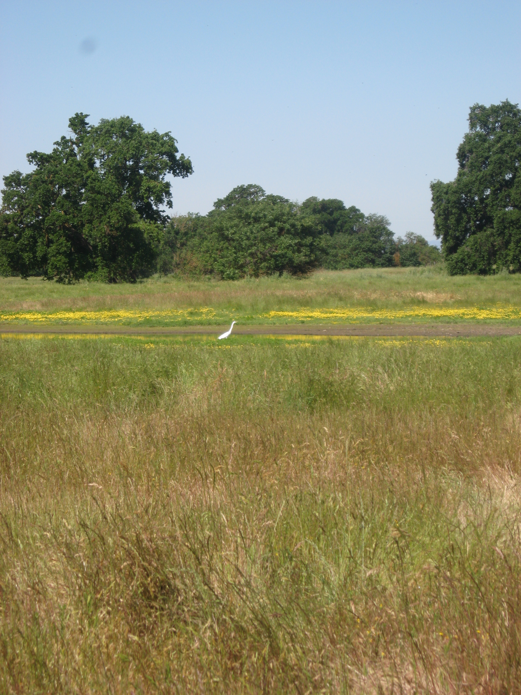
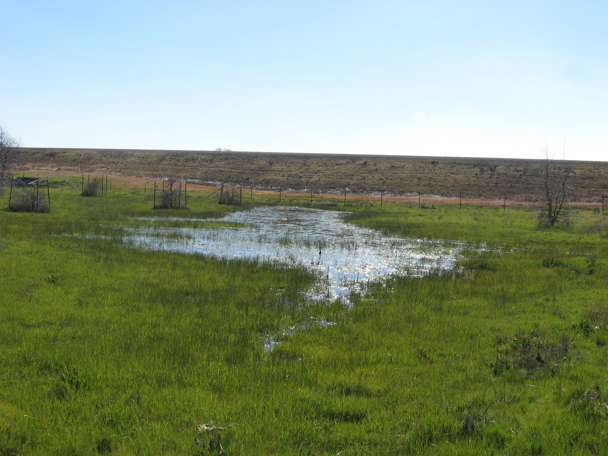

```{r question 1}
climatetable = read.table("clim.txt", header=TRUE)

tempminavg = aggregate(climatetable$tmin, list(month = climatetable$month), mean)

tempmaxavg = aggregate(climatetable$tmax, list(month = climatetable$month), mean)

temptotalavg = (tempmaxavg+tempminavg)/2
temptotalavg
  
boxplot(temptotalavg$x~temptotalavg$month,
        ylab="Average Temp (C)",
        xlab = "Month",
        col = "blue")

```


```{r}
climatetable = read.table("clim.txt", header=TRUE)

rainavg = aggregate(climatetable$rain, list(month = climatetable$month), mean)

boxplot(rainavg$x~rainavg$month,
        ylab="Average Rainfall",
        xlab = "Month",
        col = "blue")

```

```{r question 2}
climatetable = read.table("clim.txt", header=TRUE)

annualtempmin = aggregate(climatetable$tmin, list(year = climatetable$year), mean)

annualtempmax = aggregate(climatetable$tmax, list(year = climatetable$year), mean)

annualtempavg = (annualtempmax+annualtempmin)/2

  
boxplot(annualtempavg$x~annualtempavg$year,
        ylab="Average Temp (C)",
        xlab = "Year",
        col = "blue")

annualrain = aggregate(climatetable$rain, list(year = climatetable$year), mean)

boxplot(annualrain$x~annualrain$year, 
        ylab="Average Rain",
        xlab = "Year",
        col = "blue")

```

```{r wet and dry vernal pools}

divalign = "center"
imgsrc = "ESM262Assignment1Bird/DryPool.JPG"
height = 400

```

<div align = "center">
<div style="width:300px; height=200px">



</div>


```{r seasons are 1,2,3,4}
climatetable2 <- read.table("clim.txt", header = TRUE)

#Spring = 1
#Summer = 2
#Fall = 3
#Winter = 4
climatetable2$season = ifelse(climatetable2$month %in% c(3,4,5),1,
ifelse(climatetable2$month %in% c(6,7,8),2,
ifelse(climatetable2$month %in% c(9,10,11),3,4)))

```

```{r question 6}


seasonalrain = aggregate(climatetable2$rain, list(season = climatetable2$season, year = climatetable2$year), mean)

seasonaltmin = aggregate(climatetable2$tmin, list(season = climatetable2$season, year = climatetable2$year), mean)

seasonaltmax = aggregate(climatetable2$tmax, list(season = climatetable2$season, year = climatetable2$year), mean)

seasonaltemp = (seasonaltmin + seasonaltmax)/2


seasonalraingraph <- boxplot(seasonalrain$x~seasonalrain$season, 
        ylab="Average Rain",
        xlab = "Season",
        col = "blue")
```


Winter (season 4) is the wettest season, while Summer (season 2) is the driest season

```{r question 7}

winterrain = aggregate(climatetable2$rain, list(season = climatetable2$season==4, year = climatetable2$year), mean)

summertempmin = aggregate(climatetable2$tmin, list(season = climatetable2$season==2, year = climatetable2$year), mean)
summertempmax = aggregate(climatetable2$tmax, list(season = climatetable2$season==2, year = climatetable2$year), mean)
summertemp = (summertempmin + summertempmax) / 2


boxplot(summertemp$x~winterrain$x,
        ylab = "Summer Temperature (C)",
        xlab = "Winter Rain",
        col = "green")

```


The graph above models the effect of summer temperature on the amount of rain during the winter later that year. This graph would be useful to utilize when predicting the effects global warming and other fluctuations in temperature may have on rainfall patterns.